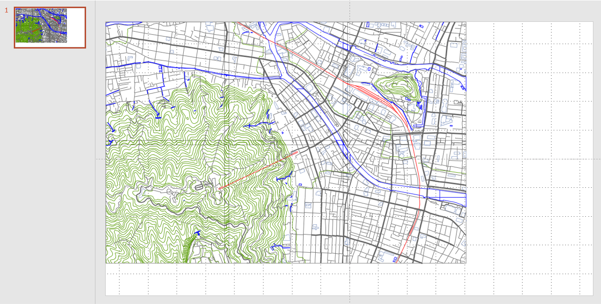

# geojson2presentation
GeoJSON を PowerPoint のスライドへ変換するツール。

Sample(shown on Microsoft PowerPoint)


## Node

Edit `mkSlideXml.js`.

```JavaScript
global.zl = 13.5  // 変換したい GeoJSON データの領域に合わせて調整
const slide = mkSlide(["./data.json"]);  // 変換したいファイルへのパス（配列で複数指定可）
```

And, run it.

```bash
node mkSlideXml.js > slide1.xml
```

Make a new pptx file, change filename extension ".pptx" to ".zip", and decompress the file.

Replace "./slide/ppt/slides/slide1.xml" to the "slide1.xml" created above.

Archive and commpress all files in a zip file, then change filename extension ".zip" to ".pptx".

You can see geometries on a office software, e.g. Microsoft PowerPoint.


## Web

https://mghs15.github.io/geojson2presentation/geo2slide.html

## Reference

* http://officeopenxml.com/drwOverview.php
* [あと一歩深い情報を得るためのロードマップ～Office Open XMLフォーマットガイド](https://www.amazon.co.jp/%E3%81%82%E3%81%A8%E4%B8%80%E6%AD%A9%E6%B7%B1%E3%81%84%E6%83%85%E5%A0%B1%E3%82%92%E5%BE%97%E3%82%8B%E3%81%9F%E3%82%81%E3%81%AE%E3%83%AD%E3%83%BC%E3%83%89%E3%83%9E%E3%83%83%E3%83%97%EF%BD%9EOffice-Open-XML%E3%83%95%E3%82%A9%E3%83%BC%E3%83%9E%E3%83%83%E3%83%88%E3%82%AC%E3%82%A4%E3%83%89-%E6%8A%80%E8%A1%93%E3%81%AE%E6%B3%89%E3%82%B7%E3%83%AA%E3%83%BC%E3%82%BA%EF%BC%88NextPublishing%EF%BC%89-%E6%8A%98%E6%88%B8/dp/4844378236/ref=tmm_pap_swatch_0?_encoding=UTF8&qid=&sr=)

